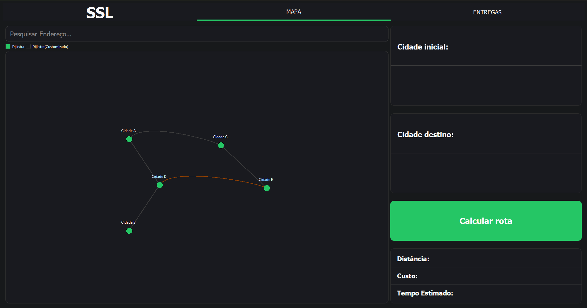
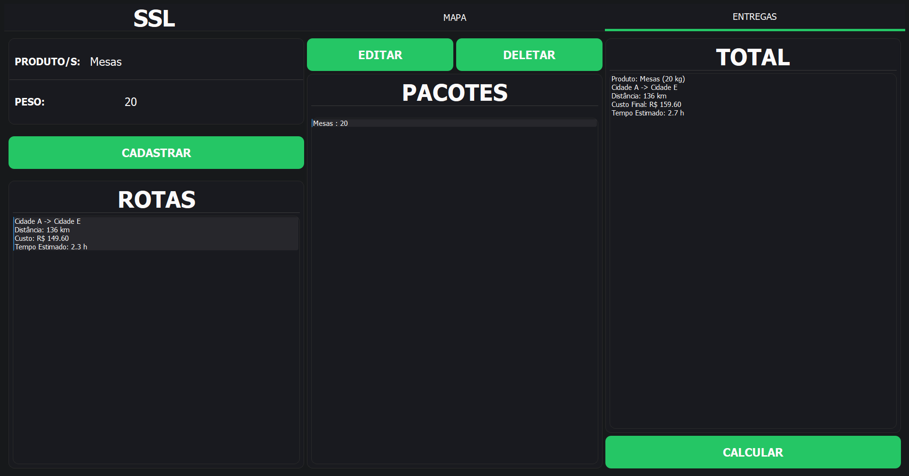

# Sistema Inteligente de Logística / Smart System of Logistic

---

## Português (PT-BR)

### 📌 Visão Geral
Este projeto foi desenvolvido como parte da disciplina de Estrutura de Dados II no Instituto Federal Catarinense, Campus Videira. O sistema simula um ambiente de logística de transporte, utilizando grafos para representar cidades e algoritmos de caminho mínimo (Dijkstra e sua variação) para calcular rotas otimizadas com base em critérios como distância ou segurança (evitando estradas de terra). A interface gráfica foi construída com a biblioteca Qt.

### 🚀 Funcionalidades
- **Representação de cidades e rotas**: Grafos modelam as conexões entre cidades, com arestas contendo informações de distância e tipo de pavimento (asfalto ou terra).
- **Cálculo de rotas**: 
  - **Algoritmo de Dijkstra**: Encontra o caminho mais curto em termos de distância.
  - **Variação de Dijkstra**: Prioriza rotas mais seguras, evitando estradas de terra.
- **Interface interativa**: 
  - Seleção de origem e destino via mapa ou campos de texto.
  - Visualização gráfica das rotas calculadas.
  - Cadastro de produtos para simulação de entregas.
- **Armazenamento hierárquico**: Árvores binárias organizam os dados das entregas.

### 📸 Imagens do Sistema
1. **Tela inicial**: Mapa gerado com cidades e conexões.  
     
2. **Rota calculada**: Exemplo de caminho mais curto entre cidades.  
     
3. **Entrega simulada**: Tela com detalhes da entrega (produto, custo, tempo).  
     

### 🛠️ Tecnologias Utilizadas
- **Linguagem**: C++
- **Biblioteca gráfica**: Qt (QGraphicsScene)
- **Estruturas de dados**: Grafos, Árvores Binárias
- **Algoritmos**: Dijkstra, Variação de Dijkstra

### 📋 Como Usar

#### Windows
1. **Download**:
   - Acesse a seção [Releases](https://github.com/alberthydev/ssl/releases/tag/ssl) no GitHub
   - Baixe o arquivo `.zip` da versão mais recente para Windows

2. **Instalação**:
   - Extraia o arquivo ZIP baixado
   - Execute o arquivo `SistemaLogistica.exe`
   - Se necessário, instale o [Microsoft Visual C++ Redistributable](https://aka.ms/vs/17/release/vc_redist.x64.exe)

#### Linux
*Disponível em breve nas próximas atualizações...*

### 📌 Conclusão
O projeto demonstra a aplicação prática de estruturas de dados e algoritmos em problemas reais de logística. Embora simplificado, o sistema permite a comparação entre diferentes critérios de otimização e serve como base para futuras expansões.

---

## English (EN)

### 📌 Overview
This project was developed as part of the Data Structures II course at Instituto Federal Catarinense, Campus Videira. The system simulates a transport logistics environment, using graphs to represent cities and pathfinding algorithms (Dijkstra and its variation) to calculate optimized routes based on criteria such as distance or safety (avoiding dirt roads). The graphical interface was built with the Qt library.

### 🚀 Features
- **City and route representation**: Graphs model connections between cities, with edges containing distance and pavement type (asphalt or dirt).
- **Route calculation**:
  - **Dijkstra's Algorithm**: Finds the shortest path in terms of distance.
  - **Dijkstra Variation**: Prioritizes safer routes, avoiding dirt roads.
- **Interactive interface**:
  - Origin and destination selection via map or text fields.
  - Graphical visualization of calculated routes.
  - Product registration for delivery simulation.
- **Hierarchical storage**: Binary trees organize delivery data.

### 📸 System Screenshots
1. **Initial screen**: Generated map with cities and connections.  
     
2. **Calculated route**: Example of the shortest path between cities.  
     
3. **Simulated delivery**: Screen with delivery details (product, cost, time).  
     

### 🛠️ Technologies Used
- **Language**: C++
- **Graphics library**: Qt (QGraphicsScene)
- **Data structures**: Graphs, Binary Trees
- **Algorithms**: Dijkstra, Dijkstra Variation

### 📋 How to Use

#### Windows
1. **Download**:
   - Visit the [Releases](https://github.com/alberthydev/ssl/releases/tag/ssl) section on GitHub
   - Download the latest Windows `.zip` file

2. **Installation**:
   - Extract the downloaded ZIP file
   - Run the `TransportSystem.exe` file
   - If required, install the [Microsoft Visual C++ Redistributable](https://aka.ms/vs/17/release/vc_redist.x64.exe)

#### Linux
*Coming soon in future updates...*

### 📌 Conclusion
The project demonstrates the practical application of data structures and algorithms in real-world logistics problems. Although simplified, the system allows for comparison between different optimization criteria and serves as a foundation for future expansions.

--- 

**Autor/Author**: Hygor Albert Fernandes Marques  
**Contato/Contact**: [alberthy.dev@gmail.com]
